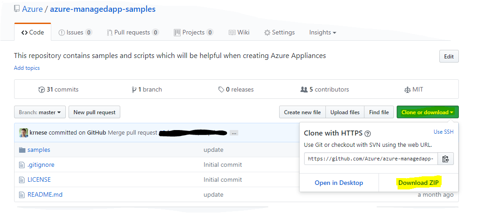
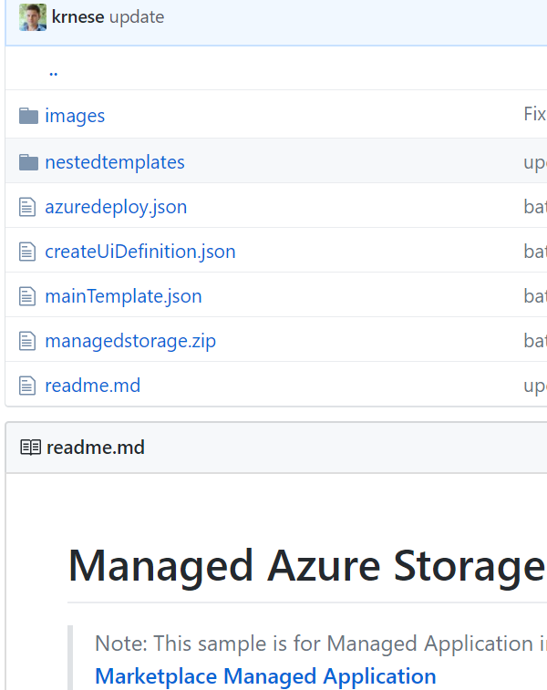

# Azure Managed Application samples

This repository contains all currently available Azure Managed Application samples contributed by the community. A 
The following information is relevant to get started with contributing to this repository.

+ [**Contribution guide**](/1-contribution-guide/README.md#contribution-guide). Describes the minimal guidelines for contributing.
+ [**Best practices**](/1-contribution-guide/best-practices.md#best-practices). Best practices for improving the quality of Azure Managed Application design.
+ [**Git tutorial**](/1-contribution-guide/git-tutorial.md#git-tutorial). Step by step to get you started with Git.
+ [**Useful Tools**](/1-contribution-guide/useful-tools.md#useful-tools). Useful resources and tools for Azure development.

## Deploying Samples

To deploy the samples into your own Azure environment, download the repository and extract the sample(s) you want to use.



Once extracted, you can use this [PowerShell script example](/1-contribution-guide/psscript.md) to modify the files to work in your environment, and initialize the Managed Application offering in Service Catalog

## Contribution guide

To make sure your Managed Application sample is added to this repository, please follow these guidelines. Any Managed Application sample that are out of compliance will be added to the **blacklist** and not be merged.

## Files, folders and naming conventions

1. Every Managed Application sample its associated files must be contained in its own **folder**. Name this folder something that describes what your Managed Application does. Usually this naming pattern looks like **appName-osName** or **level-platformCapability** (e.g. 101-managed-storage) 
 + **Required** - Numbering should start at 101. 100 is reserved for things that need to be at the top.
 + **Protip** - Try to keep the name of your template folder short so that it fits inside the Github folder name column width.
2. Github uses ASCII for ordering files and folder. For consistent ordering **create all files and folders in lowercase**. The only **exception** to this guideline is the **README.md**, that should be in the format **UPPERCASE.lowercase**.
3. Include a **README.md** file that explains how the Managed Application works, and how to deploy. 
 + Guidelines on the README.md file below.
4. A Managed Application needs to include the following files:
 + **applicaneMainTemplate.json** - The Resource Manager template that will deploy resources (and nested templates)
 + **mainTemplate.json** - The Resource Manager template with the appliance resource and definition
 + **applianceCreateUiDefinition.json** - The user interface definition file, to generate input parameters to the *mainTemplate.json* in the [Azure portal](https://portal.azure.com)
 + A generalized .zip file with all the artifacts for the Managed Application, with a placeholder for the *"applianceDefinitionId"* property in *mainTemplate.json* 
7. The custom scripts that are needed for successful template execution must be placed in a sub-folder called **scripts**.
8. Linked templates must be placed in a sub-folder called **nestedtemplates**.
9. Images used in the README.md must be placed in a folder called **images**. 


 
## README.md

The README.md describes your deployment. A good description helps other community members to understand your deployment. The README.md uses [Github Flavored Markdown](https://guides.github.com/features/mastering-markdown/) for formatting text. If you want to add images to your README.md file, store the images in the **images** folder. Reference the images in the README.md with a relative path (e.g. ``). This ensures the link will reference the target repository if the source repository is forked. A good README.md contains the following sections

+ Deployment instructions
+ PowerShell/CLI example of automated import
+ Description of what the Managed Application will deploy
+ *Optional: Prerequisites
+ *Optional: Description on how to use the Managed Application
+ *Optional: Notes

This project has adopted the [Microsoft Open Source Code of Conduct](https://opensource.microsoft.com/codeofconduct/). For more information see the [Code of Conduct FAQ](https://opensource.microsoft.com/codeofconduct/faq/) or contact [opencode@microsoft.com](mailto:opencode@microsoft.com) with any additional questions or comments.
```