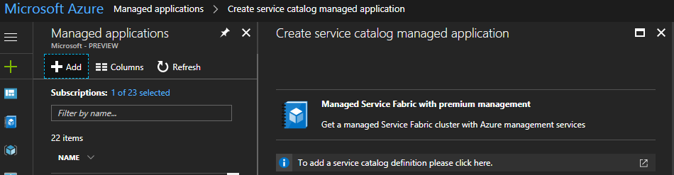

##### PowerShell sample to initialize Managed Application in Service Catalog

1. Navigate to the folder where you extracted the sample you want to use
2. Use the following script to auto generate the *mainTemplate.json* to have the *"applianceDefinitionId"* property to match your environment. 
**Ensure you change the parameters with your own values before you proceed.**
```powershell
[cmdletbinding()]
param(
    [Parameter()]
    [ValidateNotNullOrEmpty()]
    [string] $location = 'westcentralus',

    [Parameter()]
    [ValidateNotNullOrEmpty()]
    [string] $rgName = 'knappliancedef',

    [Parameter()]
    [ValidateNotNullOrEmpty()]
    [string] $ManagedApplicationName = 'ManagedServiceFabric',

    [Parameter()]
    [ValidateNotNullOrEmpty()]
    [string] $ManagedApplicationDisplayName = 'Managed Service Fabric',

    [Parameter()]
    [ValidateNotNullOrEmpty()]
    [string] $ManagedApplicationDescription = 'Managed Service Fabric with Azure management',

    [Parameter()]
    [ValidateNotNullOrEmpty()]
    [string] $principalId = '78343385-2886-470d-a12a-dd31f8758617',

    [Parameter()]
    [ValidateNotNullOrEmpty()]
    [string] $roleDefinitionId = '8e3af657-a8ff-443c-a75c-2fe8c4bcb635',

    [Parameter()]
    [ValidateNotNullOrEmpty()]
    [string] $zipFilename = 'servicefabric.zip',

    [Parameter()]
    [ValidateNotNullOrEmpty()]
    [string] $storageAccountName = 'mystorageaccount',

    [Parameter()]
    [ValidateNotNullOrEmpty()]
    [string] $storageContainerName = 'container1'
)

$localpath = if ($env:Build_Repository_LocalPath) {
    $env:Build_Repository_LocalPath
} else {
    '.'
}

try {
    # Set the mainTemplate resource Id to match parameters
    # Add the parameters from the applianceMainTemplate.json to the mainTemplate.json
    # Set the name of the resource to match the name of the Managed Application

    $applianceMainTemplate = (Get-Content -path ${LocalPath}\applianceMainTemplate.json) -join "`n" | ConvertFrom-Json 

    $azuredeployjson = @'
        {
            "$schema": "https://schema.management.azure.com/schemas/2015-01-01/deploymentTemplate.json#",
            "contentVersion": "1.0.0.0",
            "parameters": {},
            "variables": {
                "applianceInfraResourceGroupId": "[concat(resourceGroup().id,'-application-resources')]"
            },
            "resources": [
                {
                    "type": "Microsoft.Solutions/appliances",
                    "name": "",
                    "apiVersion": "2016-09-01-preview",
                    "location": "[resourceGroup().Location]",
                    "kind": "ServiceCatalog",
                    "properties": {
                        "managedResourceGroupId": "[variables('applianceInfraResourceGroupId')]",
                        "applianceDefinitionId": "appDefId",
                        "parameters": {}
                    }
                }
            ]
        }
'@

    $azuredeploytemplate = $azuredeployjson | ConvertFrom-Json
    $azuredeploytemplate.parameters = $applianceMainTemplate.parameters
    $applianceparameters = @{}
    foreach ($parameter in $applianceMainTemplate.parameters.psobject.properties) {
        $applianceparameter = @{'value' = "[parameters('$($parameter.Name)')]"}
        $value = New-Object PSObject -Property $applianceparameter
        $applianceparameters.Add($($parameter.Name), $value)
    }
    $azuredeploytemplate.resources[0].properties.parameters = New-Object PSObject -Property $applianceparameters
    $ResourceId = "[concat('/subscriptions/',subscription().subscriptionId,'/resourceGroups/${rgName}/providers/Microsoft.Solutions/applianceDefinitions/${ManagedApplicationName}')]"
    $azuredeploytemplate.resources[0].properties.applianceDefinitionId = $ResourceId
    $azuredeploytemplate.resources[0].name = $ManagedApplicationName

    Write-Output "Creating mainTemplate with new applianceDefinitionId $ResourceId"
    (ConvertTo-Json $azuredeploytemplate -Depth 10 ).Replace('\u0027', '''')|Out-File -FilePath ${LocalPath}\mainTemplate.json -Force -Encoding UTF8

    Write-Output "Creating Zip File"
    Compress-Archive -Path ${localPath}\applianceCreateUiDefinition.json, ${localPath}\mainTemplate.json, ${localPath}\applianceMainTemplate.json, ${localPath}\nestedtemplates -DestinationPath ${localPath}\${zipFilename} -Force

    Write-Output "Uploading Zip File"
    $storageResource = Find-AzureRmResource -ResourceType Microsoft.Storage/storageAccounts -ResourceNameEquals $storageAccountName
    $storageAccount = Get-AzureRmStorageAccount -StorageAccountName $storageAccountName -ResourceGroupName $storageResource.ResourceGroupName
    $container = Get-AzureStorageContainer -Name $storageContainerName -MaxCount 1 -Context $storageAccount.Context -ErrorAction SilentlyContinue

    if ($container) {
        if ($container.PublicAccess -eq 'off') {
            throw 'Container must allow public access to blobs'
        }
    } else {
        New-AzureStorageContainer -Name $StorageContainerName -Permission Blob -Context $storageAccount.Context
    }

    $null = Set-AzureStorageBlobContent -Container $storageContainerName -File $zipFilename -Context $storageAccount.Context -Force
    $packageFileUri = "https://${storageAccountName}.blob.core.windows.net/${storageContainerName}/${zipFilename}"

    $propertyObject = @{
        "LockLevel"      = "ReadOnly"
        "DisplayName"    = $ManagedApplicationDisplayName
        "Description"    = $ManagedApplicationDescription
        "Authorizations" = @(
            @{
                "principalId"      = $principalId
                "roleDefinitionId" = $roleDefinitionId
            }
        )
        "PackageFileUri" = $packageFileUri
    }

    Write-Output "Creating Application Definition"
    $rg = Get-AzureRmResourceGroup -Name $rgname -location $location -ErrorAction SilentlyContinue
    if (-not $rg) {
        Write-Output "Creating Resource Group -Name $rgname -location $location"
        New-AzureRmResourceGroup -Name $rgname -location $location
    }

    Write-Output "Creating or Updating the Appliance Definiton"
    New-AzureRmResource -ResourceName $ManagedApplicationName -ResourceType 'Microsoft.Solutions/applianceDefinitions' -ResourceGroupName $rgName -Location $location -ApiVersion '2016-09-01-preview' -PropertyObject $propertyObject -force
} catch {
    throw $_
}
```		     
Open [Azure portal](https://portal.azure.com), Managed Application, Add, and you should see your newly created Managed Application offering


