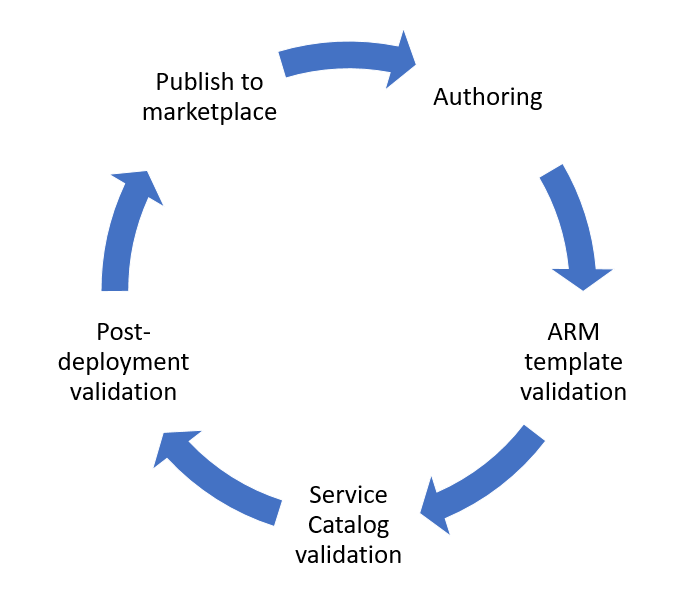
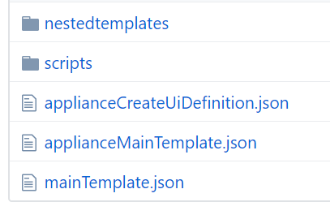

# Validation

An Azure Managed Application can be initialized in the Service Catalog within the Azure AD tenant, or be published to Azure marketplace and made available to external customers.

In this section, we present the recommended steps in order to validate a managed application, all from the general ARM templates, to Service Catalog, as well as explaining the path to Azure marketplace.

## High-level overview of validation steps for Azure Managed Application



## Authoring

For authoring, please visit the [Best practices guide](/1-contribution-guide/best-practices.md#best-practices)

## ARM template validation

* ARM template deployment

Every template being used for the managed application, must deploy successfully.
When using *nested templates* and *artifacts* such as custom scripts, you **must** ensure that the applianceMainTemplate.json can resolve the path to the templates, using ````[uri(deployment().properties.templateLink.uri, 'nestedtemplates/template.json')]````
.

Both the nested templates and any additional artifacts for a managed application will be stored in a storage account when uploading to Service Catalog and Azure Marketplace, hence your validation need to reflects this. Ensure the ````uri()````function honor the structure and resources correctly.

### Example referencing nested templates and scripts on GitHub

In the following example, our *applianceMainTemplate.json* points to a nested template and a PowerShell script, by having the following two variables:

    "variables": {
            "nestedTemplateUri": "[uri(deployment().properties.templateLink.uri, '/nestedtemplates/virtualMachine.json')]",
            "script": "[uri(deployment().properties.templateLink.uri, 'scripts/myscript.ps1')]"
        },

This will enable ARM to automatically resolve the location of the nested templates and scripts on GitHub, when having the following structure



* Conditions

If your template(s) is using ````conditions```` on one or more resources, you must ensure the templates are deployed successfully regardless of which condition is being used.
>Note: Both ````reference()```` and ````listKeys()```` are *runtime* functions, and are not allowed to manipulate the execution graph of the template. If you have resources which are referencing other another resource runtime state, they can't be used together with ````conditions````

Resources where ````conditions```` is being used, must not have an identical resource *name*. This will be ambiguous to ARM.

### Example of resource names when using conditions

            "condition": "[equals(parameters('enableMonitor'), 'No')]",
            "type": "Microsoft.Automation/automationAccounts",
            "name": "[concat(parameters('omsAutomationAccountName'), 'no')]",
            ...

            "condition": "[equals(parameters('enableMonitor'), 'Yes')]",
            "type": "Microsoft.Automation/automationAccounts",
            "name": "[concat(parameters('omsAutomationAccountName'), 'yes')]",
            ...
* Parameters

Ensure that any combination of ````allowedValues```` for your ARM templates is working, and leads to a succesful deployment.

To avoid potential failed deployments, it's recommended to define ````maxLenght````, ````minLenght````, ````maxValue````, ````minValue```` as appropriate for the parameters being used.
To further enhance and improve the end-user experience when deploying, implement regular expressions in the *applianceUiDefinition.json* to reflect and enforce valid inputs.

## Service Catalog validation

* mainTemplate.json

Ensure that every parameter declared in *applianceMainTemplate.json* is represented in the mainTemplate, and also within the *Microsoft.Solutions/appliances* resource.

To name the *managed Resource Group* properly, meaning it will guarantee a level of uniqueness when being deployed, use one of the patterns below.

### Examples of naming conventions for the managed Resource Group

````"managedResourceGroupId": "[concat(resourceGroup().id,'-application-resources')]"````

````"managedResourceGroupId": "[concat(resourceGroup().id, parameters('dnsName'))]"````

````"managedResourceGroupId": "[concat(resourceGroup().id, uniqueString('app'))]"````

````"managedResourceGroupId": "[concat(resourceGroup().id, variables('offerName'))]"````

>Note: the ````managedResourceGroupId```` property expects the ````resourceId```` of the managed Resource Group, which has the following format ````/subscriptions/{subscriptionId}/resourceGroups/{resoureGroupName}````. The examples above will ensure the expected input, combined with some sample parameters/variables to help identifying these resource groups.S

* applianceCreateUiDefinition.json

When testing your managed application within Service Catalog, you must ensure the *applianceCreateUiDefinition.json* file is generating the correct - expected output to be used for the underlying ARM templates. This requires throuhgout testing, to ensure every potential selection is not causing the deployment to fail. 

* Personas

It is likely that you as the author, have extended permission to the Azure subscription where the Service Catalog managed application is being published.
For this, we recommend you to deploy the managed application using a different Azure AD user, that is **not** a member of the Azure AD group, with access at the managed Resource Group scope.

* Endpoints

Ensure you can access and consume the application, using the ````outputs```` exposed in the Managed Application view.

## Post-deployment validation

* Access and permissions

After deployment, the persona representing the end-user/customer, should only have *view* access at the managed Resource Group scope. 
Members of the Azure AD group, which will act as the vendor/service provider, should have the respective permissions at the managed Resource Group scope, depending on the role assignment(s) they are mapped to. If you have mapped towards the *Owner* principal, ensure you can create, delete, and modify resources in the Managed Resource Group.
The Azure AD group is normally mapped to one of the [built-in RBAC roles.](https://docs.microsoft.com/en-us/azure/active-directory/role-based-access-built-in-roles)

* Manageability

As the vendor/service provider, ensure you can access and perform management using API, PowerShell/CLI and ARM templates, targeting the managed Resource Group.

## Publish to marketplace

When you plan to publish a managed application to Azure marketplace, you still need to validate the steps described above. In addition, you need to do the following:

* mainTemplate.json

Update the *mainTemplate.json* by replacing ````"kind": "serviceCatalog"```` with ````"kind": "marketplace"````, and the ````"applianceDefinitionId"```` with ````"publisherPackageId"````.
The ````Microsoft.Solutions/appliances```` resource should look similar to this:

            "type": "Microsoft.Solutions/appliances",
            "name": "[variables('managedAppName')]",
            "kind": "marketplace",
            "apiVersion": "2016-09-01-preview",
            "location": "[parameters('location')]",
            "properties": {
                "managedResourceGroupId": "managedResourceGroupId": "[concat(resourceGroup().id,'-application-resources')]",
                "publisherPackageId":"azureappliancetest.managedapptest.previewmanagedsku.1.0.0",
                "parameters": {
                    ...
                }

