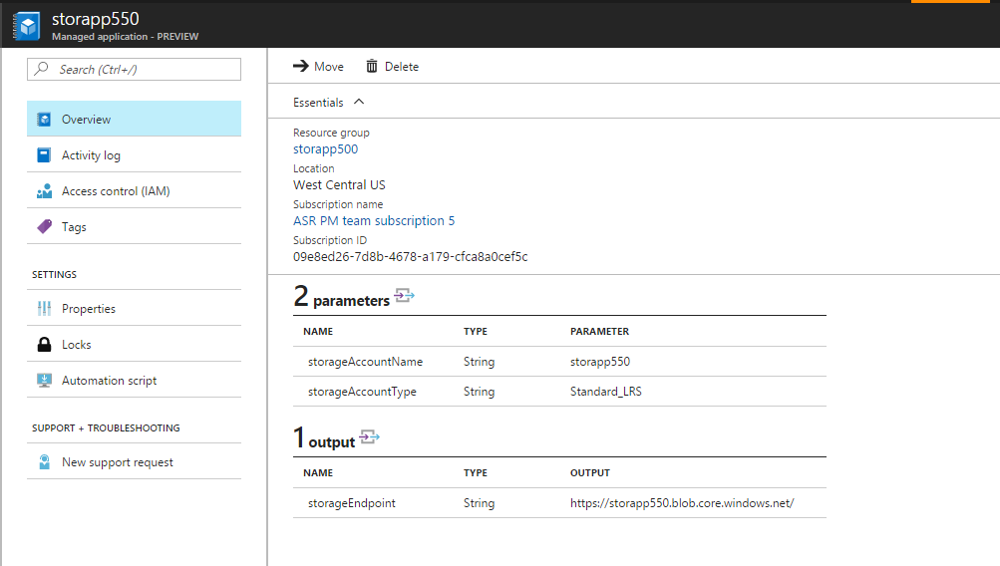

# Managed Azure Storage Account

>Note: This sample is for Managed Application in Service Catalog. For Marketplace, please see these instructions:
[**Marketplace Managed Application**](https://docs.microsoft.com/en-us/azure/managed-applications/publish-marketplace-app)

## Deploy this sample to your Service Catalog

### Deploy using Azure Portal

Clicking on the button below, will create the Managed Application definition to a Resource Group in your Azure subscription.

[](https://portal.azure.com/#create/Microsoft.Template/uri/https%3A%2F%2Fraw.githubusercontent.com%2FAzure%2Fazure-managedapp-samples%2Fmaster%2Fsamples%2F201-managed-storage-account%2Fazuredeploy.json)

### Deploy using PowerShell

````powershell
$rgname = "<yourRgName>"
$location = "<rgLocation>"
$authorization = "<userOrGroupId>:<RBACRoleDefinitionId>"
$uri = "https://raw.githubusercontent.com/Azure/azure-managedapp-samples/master/samples/201-managed-storage-account/managedstorage.zip"

New-AzureRmManagedApplicationDefinition -Name "ManagedStorage" `
                                        -ResourceGroupName $rgname `
                                        -DisplayName "Managed Storage Account" `
                                        -Description "Managed Azure Storage Account" `
                                        -Location $location `
                                        -LockLevel ReadOnly `
                                        -PackageFileUri $uri `
                                        -Authorization $authorization `
                                        -Verbose
````

### Deploy using AzureCLI

Modify the snippet below to deploy Managed Application definition to a Resource Group in your Azure subscription

````azureCLI
az managedapp definition create \
  --name "ManagedStorage" \
  --location <rgLocation> \
  --resource-group <yourRgName> \
  --lock-level ReadOnly \
  --display-name "Managed Storage Account" \
  --description "Managed Azure Storage Account" \
  --authorizations "<userOrGroupId>:<RBACRoleDefinitionId>" \
  --package-file-uri "https://raw.githubusercontent.com/Azure/azure-managedapp-samples/master/samples/201-managed-storage-account/managedstorage.zip"
````

