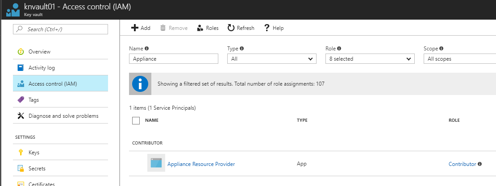
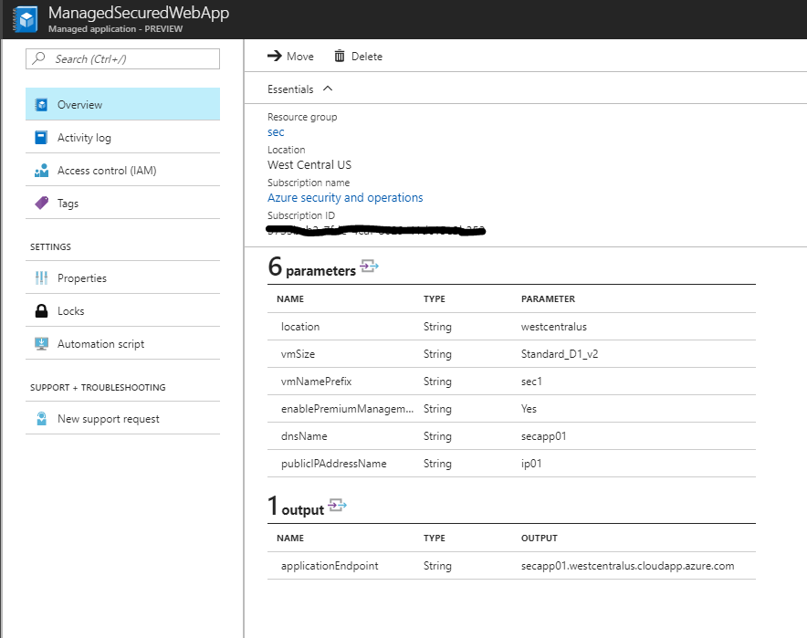

# Managed Web Application - using KeyVault

## Prerequisites

This sample is using an existing KeyVault, to retrieve the secret (password) to the virtual machine used for the managed application.

### Pre-req 1

If you haven't created and enabled a KeyVault for template deployment yet, you can create a new using AzureCLI as below:

````cli
group="myresourceGroup"
location="westcentralus"
vaultName="myVaultName"
secretName="appsecret"
secret="mySuperSecret12"

az group create -n $group -l westcentralus

az group create -n $group -l westcentralus

az keyvault create --name $vaultName --resource-group $group --location $location --enabled-for-template-deployment true

az keyvault secret set --vault-name $vaultName --name appsecret --value $secret

````

### Pre-req 2

To retrieve the secret from the KeyVault during deployment of the managed application, you must grant the **Appliance Resource Provider** *Contributor* access at the KeyVault resource



### How to try out this Azure Managed Application

First, download all the files for this sample, to a folder on your machine.

### Step 1

You will need the object Id of your Azure Ad group, and the principal Id of the Azure role, which will be used to define the level of authorization towards the underlying Azure resources.

Here's an example from my environment, where I have the object id from a newly created AAD group, and the *Owner* principal Id in Azure:

````cli
Object Id of the Azure Ad group: '2d7641f0-dbb7-4097-bb19-c098c8756086'
Principal Id of the Owner: '8e3af657-a8ff-443c-a75c-2fe8c4bcb635'
````

### Step 2

Create a new resource group where you will create the appliance definition a bit later

### Step 3

Open *mainTemplate.json* in your favorite JSON editor, and modify the following line to reflect your environment:

````json
"applianceDefinitionId": "/subscriptions/{yourSubscriptionId}/resourceGroups/{yourResourceGroupname}/providers/Microsoft.Solutions/applianceDefinitions/ManagedWebApp",
````

Save the changes

### Step 4

Open *applianceMainTemplate.json*, and modify the "id" to point to your KeyVault and secret:

````json
"administratorLoginPassword": {
                        "reference": {
                            "keyVault": {
                                "id": "/subscriptions/{subscriptionId}/resourceGroups/{resourceGroupName}/providers/Microsoft.KeyVault/vaults/{keyVaultName}"
                            },
                            "secretName": "appsecret"
                        }
                    },
````

### Step 5

Put all the three files into a zip-folder, and upload it to a storage account in Azure

### Step 6

Create the managed application definition (in westcentralus) using Azure CLI (*PowerShell support will come shortly*). Below you can see an example:

````cli
az managedapp definition create -n ManagedWebApp -l "westcentralus" --resource-group ApplianceDef --lock-level ReadOnly --display-name "Managed Web App" --description "Managed Web App with Azure management"  --authorizations "688378e8-50b1-4970-ac7e-596bf061475c:8e3af657-a8ff-443c-a75c-2fe8c4bcb635" --package-file-uri "https://catappliance.blob.core.windows.net/def/webapp.zip" --debug
````

### Step 7

You can now deploy this Managed Application (in westcentralus) from the Service Catalog in Azure

